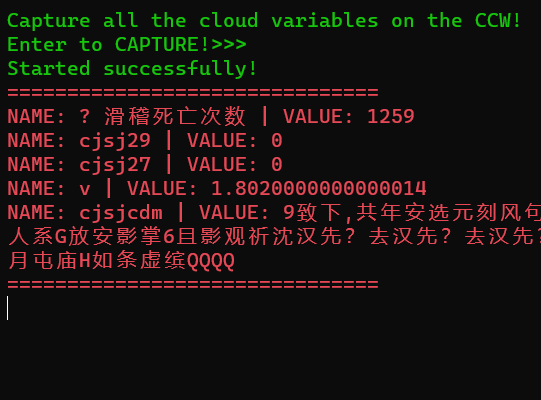
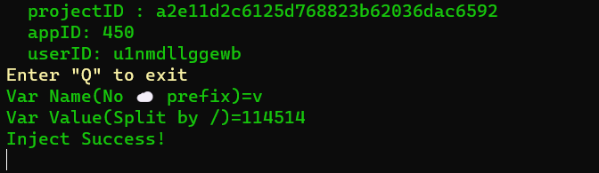

操作CCW(共创世界)云变量的工具

**使用C#编写**

作者: [Maswdle](https://github.com/Maswdle)

## 主要功能

- 获取作品云变量
- 修改/添加作品云变量
- ...

## 截图展示

## 使用教程

### CVC

#### 使用
1. 打开CVC.exe,回车安装证书.
2. 打开你要抓取的作品并重新加载.
3. 回到CVC,复制获取到的`project ID`

#### 退出

回车后等待提出卸载证书的提示,证书删除后自动退出

### CVI

按照提示即可

## 注意事项

1. 若作品加载到99%不动请重启浏览器和CVC再次尝试
2. ...

## todo

1. 添加增,删,改等功能(现在只能覆    盖)

## 下载链接

- [lanzouy](https://maswdle.lanzouy.com/iSFBH0w4vspg)
